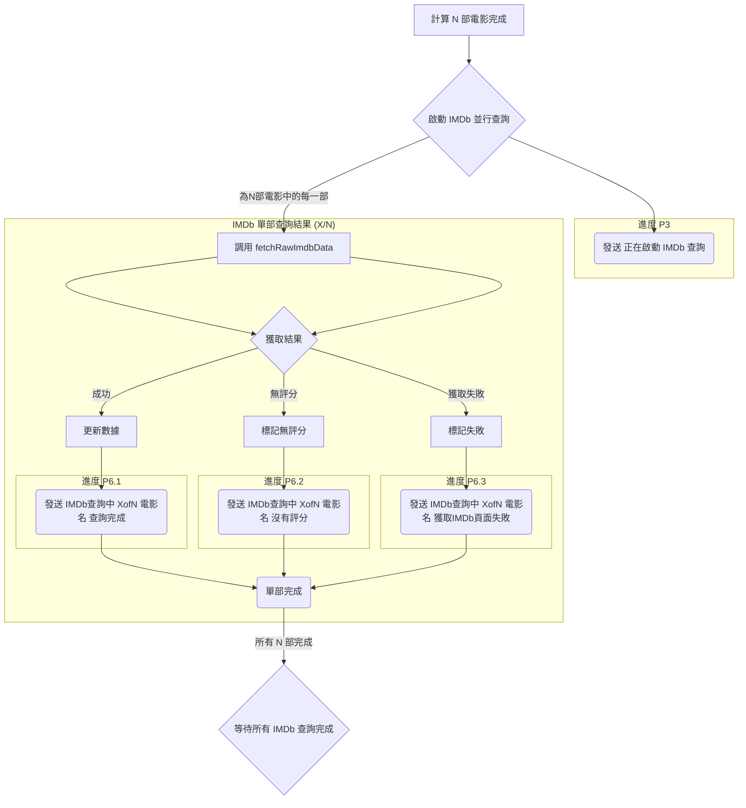

# 後端資料流 (GET_COMBINED_MOVIE_DATA)

此文件描述了在處理前端 `GET_COMBINED_MOVIE_DATA` IPC 請求時，後端主行程的資訊流和資料結構變化。

## Mermaid 流程圖 (拆分)

這裡將原來的流程圖拆分成幾個部分以便閱讀。

### 1. 主流程概覽

```mermaid
graph TD
    INIT[初始化] --> A[前端發送請求];
    A --> B(接收請求);
    B --> C{開始處理};
    C --> D[處理 SKC 資料];
    D --> CALC_N[計算 N 部電影];
    CALC_N --> E{啟動 IMDb 查詢 for N};
    E --> LOOP_IMDB{IMDb 查詢循環 (X/N)};
    LOOP_IMDB -- 完成一部 --> CHECK_ALL{檢查是否 N 部完成};
    CHECK_ALL -- 是 --> F[等待 IMDb 完成];
    CHECK_ALL -- 否 --> LOOP_IMDB;
    F --> G[合併與排序];
    G --> H{處理完成};
    H --> I[返回成功數據];

    INIT --> Z{發生錯誤};
    C --> Z;
    D --> Z;
    CALC_N --> Z;
    E --> Z;
    LOOP_IMDB --> Z;
    F --> Z;
    G --> Z;
    H --> Z;
    Z --> OERR[拋出錯誤];
```

### 2. SKC 資料處理階段 (初始化 -> 計算 N)

```mermaid
graph TD
    INIT((開始)) --> P0_NODE(發送 正在初始化&#46;&#46;&#46;);
    P0_NODE --> A[前端發送 GET COMBINED MOVIE DATA 請求];
    A --> B(ipcMain 接收請求);
    B --> C{handleGetCombinedMovieData 開始};
    C --> D[調用 fetchRawSkcData];
    subgraph "進度 P1"
      P1(發送 正在讀取新光影城資料&#46;&#46;&#46;)
    end
    D --> E{獲取 SKC 原始資料};
    E --> F[調用 processSkcData];
    subgraph "進度 P2"
      P2(發送 正在處理新光影城資料&#46;&#46;&#46;)
    end
    F --> G{處理 SKC 資料為 CombinedMovieData IMDb 為 null};
    G --> CALC_N[計算 N 部有場次電影];
     subgraph "進度 P4"
      P4(發送 完成讀取電影資料 共N部)
    end
    CALC_N --> G_DONE((SKC階段完成));

    INIT --> P0_NODE;
    D --> P1;
    F --> P2;
    CALC_N --> P4;

```


*此階段若發生錯誤，會跳轉至錯誤處理流程。*

### 3. IMDb 資料查詢階段 (計算 N -> K)


*IMDb 查詢是並行的。此階段若發生嚴重錯誤，會跳轉至錯誤處理流程。進度訊息中的 X/N 和 電影名 需要在實際發送時填充。*

### 4. 資料合併與排序階段 (K -> O)

```mermaid
graph TD
    K{IMDb 查詢完成} --> L[合併 IMDb 資料到 CombinedMovieData];
    subgraph "進度 P7"
        P7(發送 正在合併電影數據&#46;&#46;&#46;)
    end
    L --> M[根據 IMDb 評分排序電影列表];
    subgraph "進度 P8"
        P8(發送 正在排序電影列表&#46;&#46;&#46;)
    end
    M --> N{處理完成};
     subgraph "進度 P9"
        P9(發送 電影數據處理完成)
    end
    N --> O[向前端返回最終的 CombinedMovieData];

    L --> P7;
    M --> P8;
    N --> P9;
```


*此階段若發生錯誤，會跳轉至錯誤處理流程。進度訊息 P7, P8, P9 的措辭可再確認。*

### 5. 進度更新流程 (獨立視圖)

此圖展示了在整個流程中，預計向前端發送的進度更新訊息。
(注意：X/N 和電影名是動態填充的)

```mermaid
graph TD
    subgraph "進度更新訊息"
        P0(正在初始化&#46;&#46;&#46;);
        P1(正在讀取新光影城資料&#46;&#46;&#46;);
        P2(正在處理新光影城資料&#46;&#46;&#46;);
        P4(完成獲取電影資料 共N部);
        P3(正在啟動 IMDb 查詢);
        P6_1(IMDb查詢中 X/N 電影名 查詢完成);
        P6_2(IMDb查詢中 X/N 電影名 沒有評分);
        P6_3(IMDb查詢中 X/N 電影名 獲取IMDb頁面失敗);
        P7(正在合併電影數據&#46;&#46;&#46;);
        P8(正在排序電影列表&#46;&#46;&#46;);
        P9(電影數據處理完成);
        PZ(處理數據時發生錯誤&#46;&#46;&#46;);
    end
```



### 6. 錯誤處理流程

```mermaid
graph TD
    INIT((初始化)) --> Z{發生錯誤};
    C{開始處理} --> Z;
    D[調用 fetchRawSkcData] --> Z;
    F[調用 processSkcData] --> Z;
    CALC_N[計算 N 部電影] --> Z;
    H{啟動 IMDb} --> Z;
    I[調用 fetchRawImdbData] --> Z;
    K{等待 IMDb 完成} --> Z;
    L[合併數據] --> Z;
    M[排序列表] --> Z;

    subgraph "進度 PZ"
      PZ(發送 處理數據時發生錯誤&#46;&#46;&#46;)
    end
    Z --> PZ;
    Z --> OERR[向前端拋出錯誤];
```



## 各階段資料結構範例

這裡展示了資料在處理流程中不同階段的結構。參考 `src/shared/ipc-interfaces.ts` 以獲取完整類型定義。

### 1. 請求接收 (handleGetCombinedMovieData 開始)

*   **資料:** 無特定輸入資料。

### 2. 獲取 SKC 原始資料 (fetchRawSkcData 返回後)

*   **結構:** `SkcRawDataPayload` (來自 `ipc-interfaces.ts`)
*   **範例:**
    ```typescript
    {
      homePageData: { /* SK Cinema GetHomePageListForApps API 的原始 JSON 響應 */ },
      sessionData: { /* SK Cinema GetSessionByCinemasIDForApp API 的原始 JSON 響應 */ }
    }
    ```
    *註: 原始 JSON 結構龐大且複雜，此處僅作示意。*

### 3. 處理 SKC 資料後 (processSkcData 返回後)

*   **結構:** `CombinedMovieData[]` (數組，其中每個元素的 IMDb 相關欄位為 `null`)
*   **範例 (單個元素):**
    ```typescript
    {
      // --- SKC Data ---
      "filmNameID": "FP202504280003",
      "movieName": "電影日 開心鬼上身",
      "englishTitle": "HELLO GHOST",
      "posterUrl": "https://pic.skcinemas.com/FilmPhoto/FP202504280003/FP202504280003-A.jpg",
      "skRating": "保護級",
      "ratingDescription": "車太鉉主演...",
      "runtimeMinutes": 111,
      "sessions": [
        {
          "date": "05-16",
          "weekday": "週五",
          "showtime": "21:30",
          "endTime": "23:21",
          "filmType": "數位",
          "screenName": "12廳"
        }
        // ... more sessions
      ],
      // --- IMDb Data (尚未獲取) ---
      "imdbRating": null,
      "imdbUrl": null,
      "plot": null,
      "genres": null,
      "directors": null,
      "cast": null
    }
    ```

### 4. 獲取單部電影 IMDb 資料後 (fetchRawImdbData 返回後)

*   **結構:** `ImdbRawDataPayload` (來自 `ipc-interfaces.ts`) 或 包含 `error` 的物件
*   **範例 (成功):**
    ```typescript
    {
      "imdbUrl": "https://www.imdb.com/title/tt1841642/",
      "imdbRating": "7.6",
      "plot": "A man attempts suicide but fails...",
      "genres": ["Comedy", "Drama", "Family"],
      "directors": ["Young-tak Kim"],
      "cast": ["Cha Tae-hyun", "Kang Ye-won", "Lee Moon-su"],
      "jsonLd": { /* 從 IMDb 頁面提取的 JSON-LD 資料 */ }
      // "error": undefined
    }
    ```
*   **範例 (失敗):**
    ```typescript
    {
      "error": "Failed to find movie on IMDb after multiple attempts."
      // 其他欄位可能為 undefined
    }
    ```

### 5. 合併 IMDb 資料並排序後 (最終返回給前端前)

*   **結構:** `CombinedMovieData[]` (數組，IMDb 相關欄位已填充，並按評分排序)
*   **範例 (單個元素):**
    ```typescript
    {
      // --- SKC Data ---
      "filmNameID": "FP202504280003",
      "movieName": "電影日 開心鬼上身",
      "englishTitle": "HELLO GHOST",
      "posterUrl": "https://pic.skcinemas.com/FilmPhoto/FP202504280003/FP202504280003-A.jpg",
      "skRating": "保護級",
      "ratingDescription": "車太鉉主演...", // 注意：plot 可能會覆蓋這個
      "runtimeMinutes": 111,
      "sessions": [
        // ... sessions
      ],
      // --- IMDb Data (已填充) ---
      "imdbRating": "7.6", // 已填充
      "imdbUrl": "https://www.imdb.com/title/tt1841642/", // 已填充
      "plot": "A man attempts suicide but fails...", // 已填充 (可能覆蓋 ratingDescription)
      "genres": ["Comedy", "Drama", "Family"], // 已填充
      "directors": ["Young-tak Kim"], // 已填充
      "cast": ["Cha Tae-hyun", "Kang Ye-won", "Lee Moon-su"] // 已填充
    }
    ```
    *注意：如果某部電影的 IMDb 資料無法獲取評分 (但頁面找到)，其 `imdbRating` 會被設為特殊值 `'-1'` (代表「未評分」)。如果 IMDb 資料獲取失敗或找不到電影，`imdbRating` 會被設為 `'-2'` (代表「查詢失敗」)，其他 IMDb 相關欄位可能為 `null`。排序邏輯會將 `評分數字 > -1 > -2`。* 