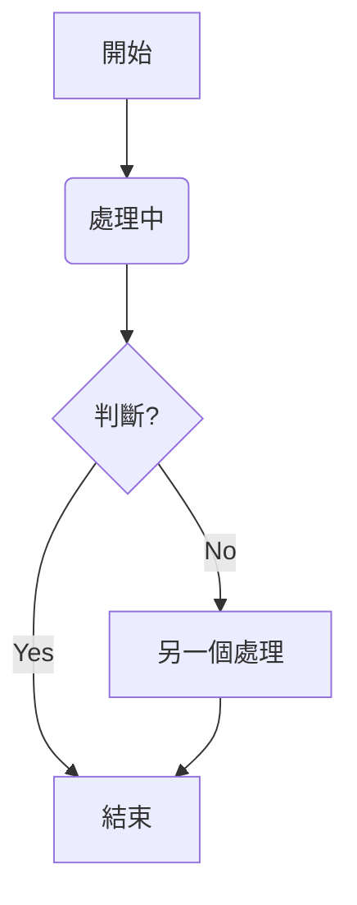
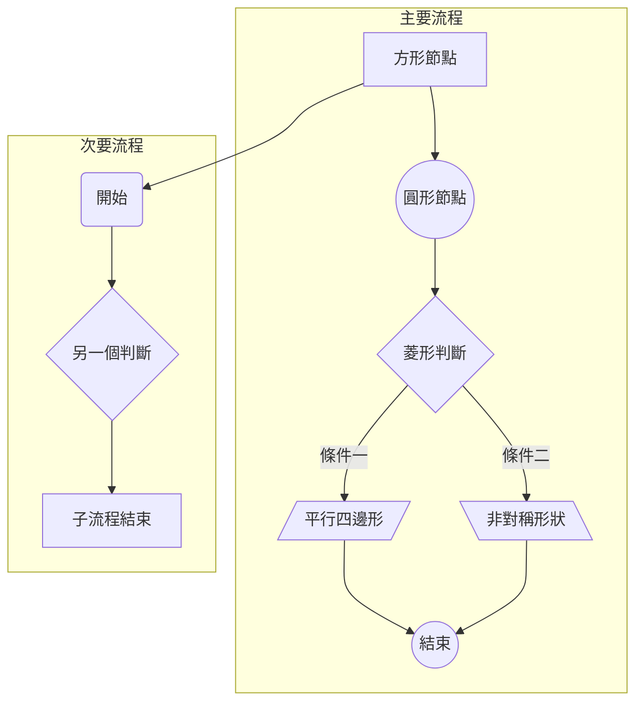

# Mermaid 圖表示例

## 1. 簡單流程圖 (Simple Flowchart)

```mermaid
graph TD
    A[開始] --> B(處理中);
    B --> C{判斷?};
    C -- Yes --> D[結束];
    C -- No --> E[另一個處理];
    E --> D;
```

## 2. 中等複雜度流程圖 (Medium Flowchart with Subgraphs and Shapes)

```mermaid
graph TD
    subgraph "主要流程"
        A[方形節點] --> B((圓形節點));
        B --> C{菱形判斷};
        C -- 條件一 --> D[/平行四邊形/];
        C -- 條件二 --> E[\非對稱形狀\];
        D --> F((結束));
        E --> F;
    end

    subgraph "次要流程"
        G(開始) --> H{另一個判斷};
        H --> I[子流程結束];
    end

    A --> G;
```
</rewritten_file> 